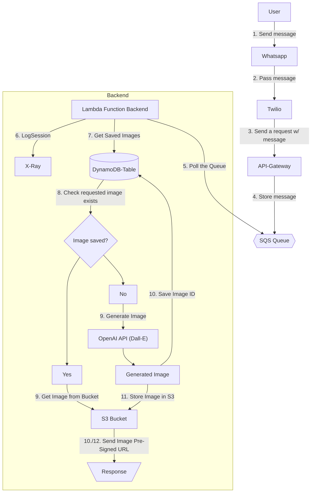

# Cloudformation Template

The cloudformation template provided allows you to quickly start with the application by setting for you all the resoures that are required in your AWS account.

## Cloud Architecture



## Pre-requisites

1. Install the [AWS SAM CLI](<https://docs.aws.amazon.com/serverless-application-model/latest/developerguide/serverless-sam-cli-install.html>)
2. Configure the [AWS CLI](https://docs.aws.amazon.com/cli/latest/userguide/cli-chap-configure.html)

## Instructions

1. Build the deployment packages using:

   ```sh
   sam build
   ```

2. Deploy the resources using the command:

    ```sh
    sam deploy --guided
    ```

    And follow the instructions, you'd be prompted to pass some parameters from the command line such
    as your Twilio Authentication Token, Account SID and phone number to use for sending messages.
    > For Stack Name you can use the name of your application or the repo name `openai-ws-bot`.

3. From the outputs, copy the URL of the development API to use in Twilio:

   

4. Copy that url in the endpoint URL field of your Twilio Sandbox configuration

   

## Cleanup

You can easily remove all the deployed resources using the SAM CLI.

Delete the whole stack using the command:

```sh
sam delete
```
